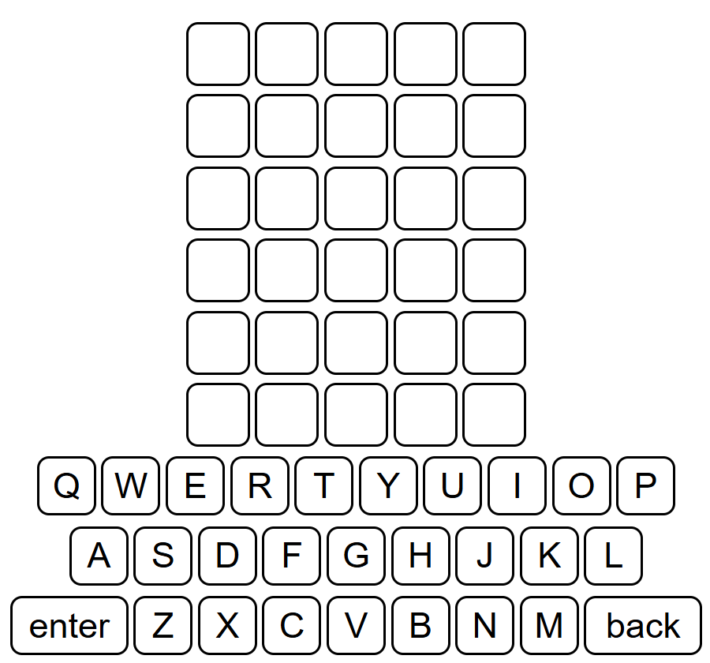

# Creating a wordle game


wordle is a famous game that every one have played or heard of, the game helps improve vocabulary and problem solving witch makes it fun.

## First step:
To creat a wordle game, we need to build the front page where the user can sumbet the word to see if it was correct or not.

And to start we need to understand how to creat a 5 by 5 squares to put the letters in, that can be created using flexbox.

Flexbox is basically a container that contain items that can be easily manipulative.

*Example:*

```html
<section>
    <div></div>
    <div></div>
    <div></div>
    <div></div>
</section>    
```

## second step

After creating the first flexbox, lets fix it position to make it easier for the user to look at by editing the style.

```css
section{
  width: 450px;
  margin: 20px auto;
}

div{
  width: 75px;
  height: 75px;
  display: inline-block;
  border: 2px solid black;
  background-color: white;
}
```
and by doing that for the upper and the lower parts of our project(changing from div to buttons for the lower part),we can build something like:



## third step

now we want to make the buttens work, and to do that we need to give the buttons and the squares classes :

```html
<section>
    <div class="square"></div>
    <div class="square"></div>
    <div class="square"></div>
    <div class="square"></div>
</section>  

<section>
    <button class="key" >A</button>
    <button class="key" >B</button>
    <button class="key" >C</button>
    <button class="key" >D</button>
</section>    
```

then declare constants for both the div and the button in js :

```js
let key = document.querySelectorAll('.key')
let square = document.querySelectorAll('.square')
```

after the delartions we can creat functions so that when a butten is pressed the letter on that button innerText well appear inside of the empty square :

```js
key.forEach(letter => {
 letter.addEventListener('click', () => {
  //the content...
 })
})
```

the reson for using forEach here is because we have multiable buttons with the same class, forEach help us go through all the buttons.

```js
let squareFull = 0;
let userword =[];
let squareNumber = 0;

key.forEach(letter => {
 letter.addEventListener('click', () => {
  if(squareFull <= 4){
    square[squareNumber].innerText = letter.innerText;
    userword.push(letter.innerText)
    squareFull = squareFull + 1
    squareNumber = squareNumber+1
  }
 })
})
```

squareFull well make shore the user dosen't enter more that 5 letters, userword well save the user word and squareNumber print the letter the user shosed by the help of innerText.

## 4th step

now we check if the word exisit or not. so, let update our function : 

```js
key.forEach(letter => {
 letter.addEventListener('click', () => {
  if(squareFull <= 4){
    square[squareNumber].innerText = letter.innerText;
    userword.push(letter.innerText)
    squareFull = squareFull + 1
    squareNumber = squareNumber+1
  }
  if( letter.innerText == 'enter' && squareFull == 5){
  switch (userword[0]) {
    case "A":
      // wors if a constant that store all the words that are possiable for our game
        for (let i = 0; i < words[0].A.length; i++) {
            if (words[0].A[i] == userword.join('')) {
            // more content...
            break;
         }
       }
     }
   }
 })
})
```

and now we need to notefy the user by changing the color of the background of the squars. so, lets creat a function that do all of that, then put it inside the loop :

```js
function enters() {
   
for ( var i = 0 ; i < 5; i++) {

     square[count].style.backgroundColor = 'gray'
    for (let k = 0; k < key.length; k++) {
            if (key[k].id.toUpperCase() == userword[i]) {
                key[k].style.backgroundColor = 'gray'
            }
    }

for ( var j = 0 ; j < 5; j++) {
       //one is an array that hold the letters of the chosen word
    if (userword[i] == one[i]) {   

        square[count].style.backgroundColor = "green"
        for (let k = 0; k < key.length; k++) {
            if (key[k].id.toUpperCase() == userword[i]) {
                key[k].style.backgroundColor = "green"
            }
        }

    }else if (userword[i] == one[j]) {

        square[count].style.backgroundColor = "yellow"
        for (let k = 0; k < key.length; k++) {
            if (key[k].id.toUpperCase() == userword[i]) {
                key[k].style.backgroundColor = "yellow"
            }
        }
    }
}
count++
}

}

```

## 5th step

Now, what if the user decided to backspace, for that lets build a back function that delete the latter when back is pressed :

```js
function back() {

if(square[squareFull] !== " " && squareFull > 0){
        
    square[squareNumber-1].innerText = "";
    userword.pop()
    squareFull = squareFull + 1
    squareNumber = squareNumber+1
 }
}
```
and by running the back function in the key function we are done with the main code