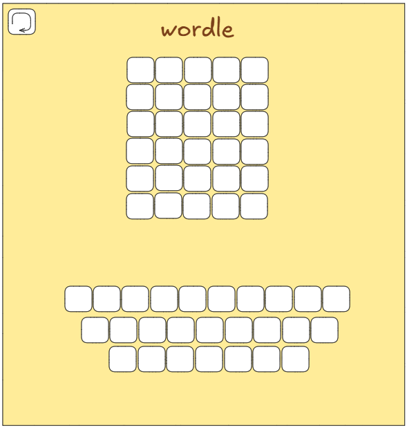

# Creating a wordle game


## First step:
To creat a wordle game, we need to build the front page where the user can inter an the word to see if it was correct or not.

And to start we need to understand how to creat a 5 by 5 squares to put the letters in, that can be created using flexbox.

Flexbox is basically a container that contain items that can be easily manipulative.

*Example:*

```html
<section>
    <div></div>
    <div></div>
    <div></div>
    <div></div>
</section>    
```

## second step

After creating the first flexbox, lets fix it position to make it easier for the user to look at by editing the style.

```css
section{
  width: 450px;
  margin: 20px auto;
}

div{
  width: 75px;
  height: 75px;
  display: inline-block;
  border: 2px solid black;
  background-color: white;
}
```

